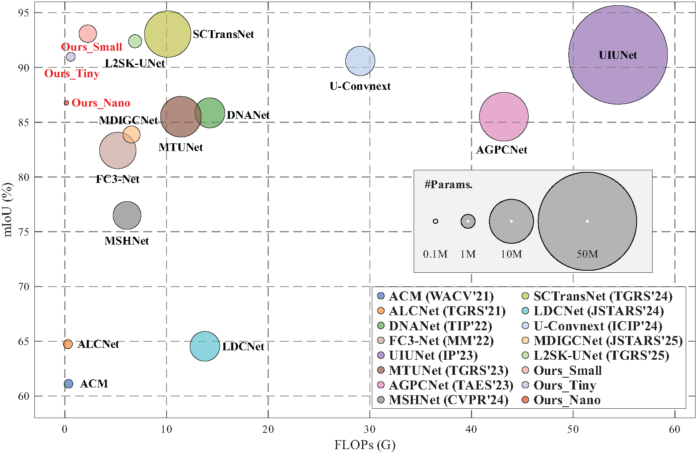
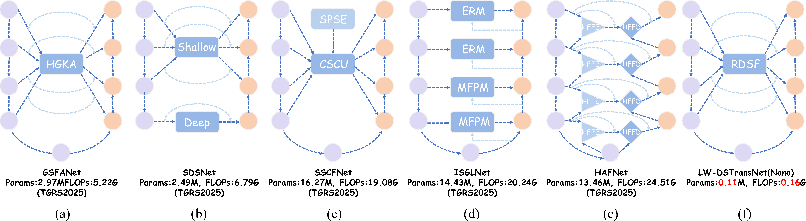
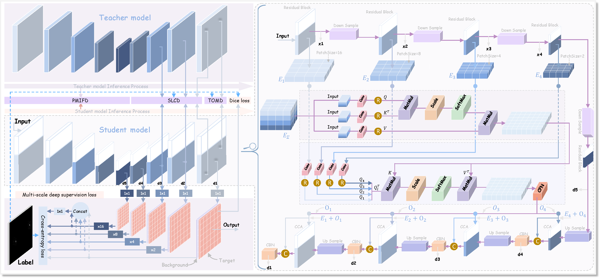
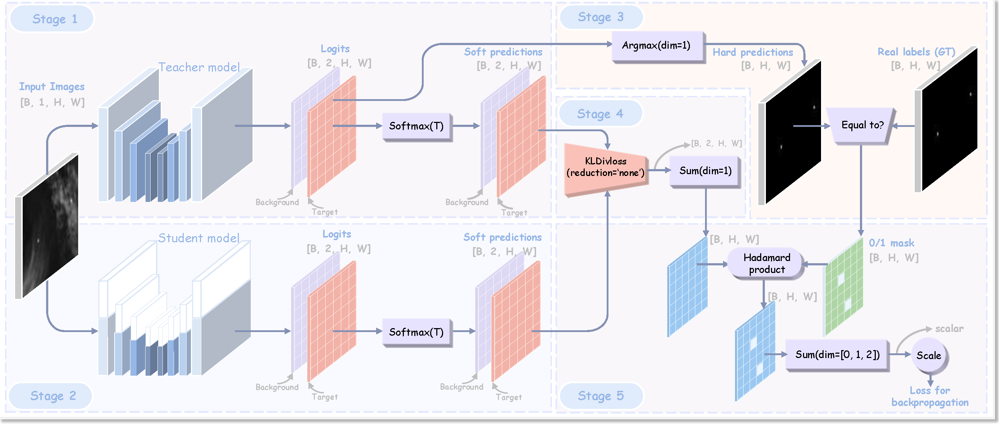
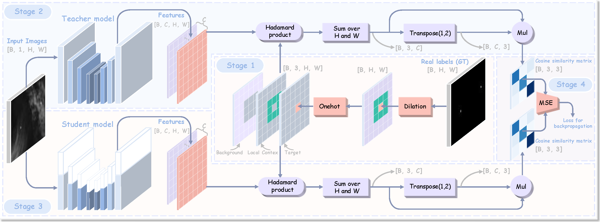
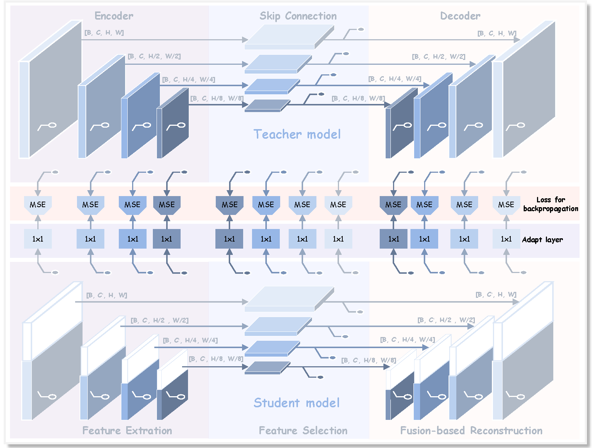
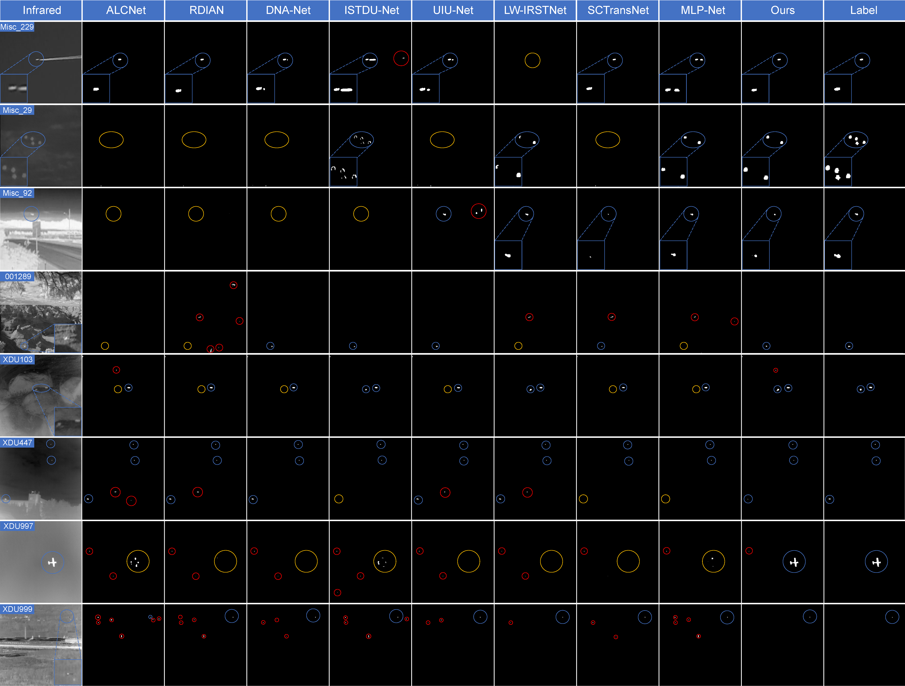

# LW-DSTransNet

[](https://github.com/RuiminHuang/DSTransNet)
[](https://www.python.org/)
[](https://pytorch.org/)
[](./LICENSE)
[](https://github.com/RuiminHuang/LW-DSTransNet)

The official implementation of the paper "Toward Extremely Efficient Infrared Small Target Detection Via Universal U-Net-based Knowledge Distillation" in PyTorch.

> This repository provides **clean and readable** code.

## Contents

- [:sparkles: 1. Introduction](#sparkles-1-introduction)
- [:building_construction: 2. The Network](#building_construction-2-the-network)
  - [:repeat: 2.1 Overall Pipeline](#repeat-21-overall-pipeline)
  - [:jigsaw: 2.2 Core Module](#jigsaw-22-core-module)
- [:rocket: 3. Installation](#rocket-3-installation)
- [:bar_chart: 4. Dataset Preparation](#bar_chart-4-dataset-preparation)
  - [:link: 4.1 Datasets Link](#link-41-datasets-link)
  - [:file_folder: 4.2 File Structure](#file_folder-42-file-structure)
- [:fire: 5. Train](#fire-5-train)
- [:dart: 6. Test](#dart-6-test)
- [:trophy: 7. Benchmark and Model Zoo](#trophy-7-benchmark-and-model-zoo)
  - [:chart_with_upwards_trend: 7.1 Quantitative Results](#chart_with_upwards_trend-71-quantitative-results)
  - [:framed_picture: 7.2 Qualitative Results](#framed_picture-72-qualitative-results)
  - [:package: 7.3 Model Zoo](#package-73-model-zoo)
- [:bookmark_tabs: 8. Citation](#bookmark_tabs-8-citation)
- [:star2: 9. Star History](#star2-9-star-history)
- [:email: 10. Contact](#email-10-contact)


---

## :sparkles: 1. Introduction

<div align="center">
  
</div>

Tradeoff between mIoU, number of parameters (\#Params.), and floating point operations (FLOPs). Results are achieved on the NUDT-SIRST dataset. FLOPs is tested with an input image at a resolution of 256 $\times 256$.


<div align="center">
  
</div>
Inference time comparison of different models on NVIDIA Jetson Orin NX.


<div align="center">
  
</div>
Inference time comparison of different models on Rockchip RK3588.




Network architectures and visualization results of representative IRSTD methods. (a) GSFANet. (b) SDSNet. (c) SSCFNet. (d) ISGLNet. (e) HAFNet. (f) DSTransNet and the proposed LW-DSTransNet.


## :building_construction: 2. The Network

### :repeat: 2.1 Overall Pipeline

Overall framework of knowledge distillation, consisting of a universal teacher network, a LW-DSTransNet student network, and three knowledge distillation strategies: TOMD, SLCD, and PMIFD.

### :jigsaw: 2.2 Core Module

Overview of the TOMD Strategy. It employs a dynamic confidence mask to explicitly block harmful gradient propagation, ensuring that the student network is guided only by trustworthy knowledge.


Overview of the SLCD Strategy. It leverages a triplet semantic topology constraint to guide the student network to learn discriminative representations that decouple the target from local background features in the feature space.


Overview of the PMIFD strategy. Through multi-stage feature alignment, it encourages the student network to capture the teacher's complete reasoning logic and enhances its capability to model small-target feature evolution.

## :rocket: 3. Installation

* Step 1. Clone the repository

```shell
git clone git@github.com:RuiminHuang/LW-DSTransNet.git
cd LW-DSTransNet
```

* Step 2. Create environment and install dependencies

```shell
conda create --name LW-DSTransNet python=3.12
conda activate LW-DSTransNet
conda install pytorch==2.4.1 torchvision==0.19.1 torchaudio==2.4.1 pytorch-cuda=12.1 -c pytorch -c nvidia
pip install tensorboard==2.19.0
pip install tqdm==4.65.0
```


## :bar_chart: 4. Dataset Preparation


### :link: 4.1 Datasets Link
The dataset comes from [this GitHub repository](https://github.com/GrokCV/SeRankDet). The datasets used in this project and the dataset split files can be downloaded from the following links:

* SIRST Dataset
  * [Baidu Netdisk](https://pan.baidu.com/s/1LgnBKcE8Cqlay5GnXfUaLA?pwd=grok)
  * [OneDrive](https://1drv.ms/f/s!AmElF7K4aY9pgYEgG0VEoH3nDbiWDA?e=gkUW2W)
* NUDT-SIRST Dataset
  * [Baidu Netdisk](https://pan.baidu.com/s/16BbL9H38cIcvaBh4tPNTCw?pwd=grok)
  * [OneDrive](https://1drv.ms/f/s!AmElF7K4aY9pgYEdBMrQDFM1Vi24DQ?e=vBNoN4)
* IRSTD1K Dataset
  * [Baidu Netdisk](https://pan.baidu.com/s/1nRoZu1eI9BLnpmsxw0Kdwg?pwd=grok)
  * [OneDrive](https://1drv.ms/f/s!AmElF7K4aY9pgYEepi2ipymni0amNQ?e=XZILFh)


### :file_folder: 4.2 File Structure

```shell
|- datasets
    |- NUAA
        |-trainval
            |-images
                |-Misc_1.png
                ......
            |-masks
                |-Misc_1.png
                ......
        |-test
            |-images
                |-Misc_50.png
                ......
            |-masks
                |-Misc_50.png
                ......
    |-NUDT
    |-IRSTD1k
```


Before running the code, make sure to update the dataset path in the config file:


## :fire: 5. Train

```shell
python train.py
```

Before training, specify the target datasets in the configuration file:


To view train process, run TensorBoard with:

```shell
tensorboard --port=8010 --samples_per_plugin=images=100000 --logdir=./
```


## :dart: 6. Test

```shell
python test.py
```

Before testing, specify the pre-trained weights and target datasets in the configuration file:


To view test results, run TensorBoard with:

```shell
tensorboard --port=8010 --samples_per_plugin=images=100000 --logdir=./
```


## :trophy: 7. Benchmark and Model Zoo

### :chart_with_upwards_trend: 7.1 Quantitative Results

* LW-DSTransNet-Nano

| Datasets      |Params(M)|FLOPs(G)| mIoU (x10(-2)) | nIoU (x10(-2)) | Pd (x10(-2))|  Fa (x10(-6))|
|:-------------:|:-------:|:------:|:-------------:|:-----:|:-----:|:-----:|
| SIRST         |  0.107  |  0.155 |74.25          |74.45  |99.08  |36.46  |
| NUDT-SIRST    |  0.107  |  0.155 |86.77          |87.32  |98.83  |3.20   |
| IRSTD-1K      |  0.107  |  0.155 |67.81          |65.76  |91.92  |18.83  |

* LW-DSTransNet-Tiny

| Datasets      |Params(M)|FLOPs(G)| mIoU (x10(-2)) | nIoU (x10(-2)) | Pd (x10(-2))|  Fa (x10(-6))|
|:-------------:|:-------:|:------:|:-------------:|:-----:|:-----:|:-----:|
| SIRST         |  0.409  |  0.581 |74.73          |75.50  |96.33  |9.94   |
| NUDT-SIRST    |  0.409  |  0.581 |90.97          |91.33  |99.30  |2.34   | 
| IRSTD-1K      |  0.409  |  0.581 |69.17          |66.73  |90.57  |27.31  |


* LW-DSTransNet-Small

| Datasets      |Params(M)|FLOPs(G)| mIoU (x10(-2)) | nIoU (x10(-2)) | Pd (x10(-2))|  Fa (x10(-6))|
|:-------------:|:-------:|:------:|:-------------:|:-----:|:-----:|:-----:|
| SIRST         |  1.601  |  2.253 |75.47          |76.40  |96.33  |10.11  |
| NUDT-SIRST    |  1.601  |  2.253 |93.08          |93.41  |99.53  |0.15   |
| IRSTD-1K      |  1.601  |  2.253 |70.69          |66.85  |92.59  |21.22  |


### :framed_picture: 7.2 Qualitative Results



2D visualization of detection results across different methods on representative images from SIRST, NUDT-SIRST, and IRSTD-1k datasets. Blue, yellow, and red circles denote correct detections, missed detections, and false alarms, respectively.


### :package: 7.3 Model Zoo

TensorBoard logs, train logs, test logs, pre-trained weights, and test results are available on [Google Drive](https://drive.google.com/drive/folders/1Cktwh19m4gm0PVY63o_HWHXe6CXkqhOf?usp=sharing). Just download and unzip it to the [log path](./logs/).

## :bookmark_tabs: 8. Citation

If you find this repository useful for your research, please consider citing our paper using the following BibTeX entry.

```bibtex
@article{huang2026toward,
  title={Toward Extremely Efficient Infrared Small Target Detection Via Universal U-Net-based Knowledge Distillation},
  author={Huang, Ruimin and Huang, Jun and Ma, Yong and Fan, Fan and Zhu, Yiming},
  journal={xxxx},
  volume={xx},
  pages={x--xx},
  year={xxxx},
  publisher={xxxx}
}
```

## :star2: 9. Star History

If you find this repository useful for your research, please consider giving it a star.

<!-- [](https://star-history.com/#RuiminHuang/LW-DSTransNet&Date) -->

<a href="https://www.star-history.com/?repos=RuiminHuang%2FLW-DSTransNet&type=date&legend=top-left">
 <picture>
   <source media="(prefers-color-scheme: dark)" srcset="https://api.star-history.com/chart?repos=RuiminHuang/LW-DSTransNet&type=date&theme=dark&legend=top-left" />
   <source media="(prefers-color-scheme: light)" srcset="https://api.star-history.com/chart?repos=RuiminHuang/LW-DSTransNet&type=date&legend=top-left" />
   
 </picture>
</a>


## :email: 10. Contact

Please feel free to raise issues or email to [huang_ruimin@whu.edu.cn](huang_ruimin@whu.edu.cn) for any questions regarding our DSTransNet.
